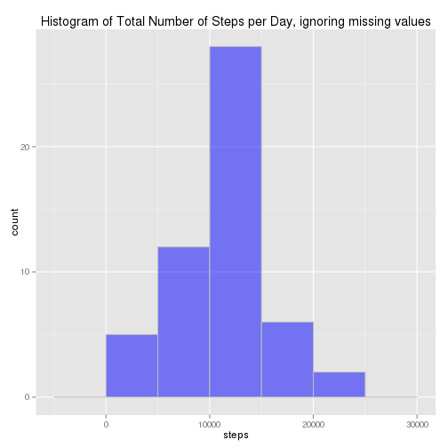
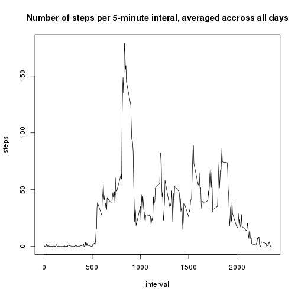
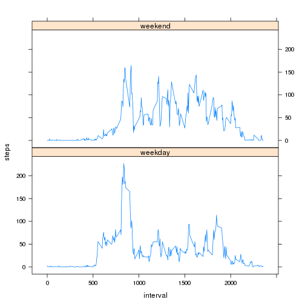

*Report generated 15 November, 2015 16:09*

## Loading and preprocessing the data

Load required libraries.


```r
library(ggplot2)
library(lattice)
```

Load the data into a simple data frame.


```r
unzip('activity.zip', overwrite=TRUE)
activity <- read.csv('activity.csv', stringsAsFactors=FALSE)
```

## What is mean total number of steps taken per day?

##### Calculate the total number of steps taken per day


```r
dates.factor <- as.factor(activity$date)
stepsPerDay <- tapply(activity$steps, activity$date, sum)
stepsPerDay <- data.frame(steps=stepsPerDay, date=levels(dates.factor))
summary(stepsPerDay, digits=12)
```

```
##      steps                   date   
##  Min.   :   41.000   2012-10-01: 1  
##  1st Qu.: 8841.000   2012-10-02: 1  
##  Median :10765.000   2012-10-03: 1  
##  Mean   :10766.189   2012-10-04: 1  
##  3rd Qu.:13294.000   2012-10-05: 1  
##  Max.   :21194.000   2012-10-06: 1  
##  NA's   :8           (Other)   :55
```

##### Make a histogram of the total number of steps taken each day


```r
g <- ggplot(stepsPerDay, aes(x=steps)) +
    geom_histogram(color='grey',fill='blue', alpha=0.50, binwidth=5000) +
    ggtitle('Histogram of Total Number of Steps per Day, ignoring missing values')
g
```

 

##### Calculate and report the mean and median of the total number of steps taken per day

As noted in the assignent, for this part of the report, I ignore the missing
values in the dataset.


```r
mean.steps.na <- mean(stepsPerDay$steps, na.rm=TRUE)
median.steps.na <- median(stepsPerDay$steps, na.rm=TRUE)
mean.steps.na
```

```
## [1] 10766.19
```

```r
median.steps.na
```

```
## [1] 10765
```

## What is the average daily activity pattern?

Pack the calculation in a function, since I will need it again later.


```r
time.series <- function(activity) {
    dates.factor <- as.factor(activity$date)
    ndays <- nlevels(dates.factor)
    stepsPer5MinInterval <- tapply(activity$steps, activity$interval, sum, na.rm=TRUE)/ndays
    intervals <- sort(unique(activity$interval))
    stepsPer5MinInterval <- data.frame(steps=stepsPer5MinInterval, interval=intervals)
}
```

##### Calculate the average number of steps taken during each 5-minute interval, averaged across all days


```r
stepsPer5MinInterval <- time.series(activity)
```

##### Make a time series plot (i.e. `type = "l"`) of the 5-minute interval (x-axis) and the average number of steps taken, averaged across all days (y-axis)


```r
with(stepsPer5MinInterval, plot(interval, steps, type='l'))
title('Number of steps per 5-minute interal, averaged accross all days')
```

 

We see that the subject wakes up around 6:00 and most of the steps are taken
before 10:00. The activity slows down afterwards. Around 23:00 the subject goes
to bed.

##### Which 5-minute interval, on average across all the days in the dataset, contains the maximum number of steps?


```r
interval.max <- with(stepsPer5MinInterval, interval[which.max(steps)])
interval.max
```

```
## [1] 835
```

The maximum number of steps takes place around 08:35.

## Imputing missing values

##### Calculate and report the total number of missing values in the dataset (i.e. the total number of rows with `NA`s)

As can be seen in the summary only the `steps` column has `NA` values.


```r
summary(activity)
```

```
##      steps            date              interval     
##  Min.   :  0.00   Length:17568       Min.   :   0.0  
##  1st Qu.:  0.00   Class :character   1st Qu.: 588.8  
##  Median :  0.00   Mode  :character   Median :1177.5  
##  Mean   : 37.38                      Mean   :1177.5  
##  3rd Qu.: 12.00                      3rd Qu.:1766.2  
##  Max.   :806.00                      Max.   :2355.0  
##  NA's   :2304
```

```r
na.steps <- sum(is.na(activity$steps))
```

There are 2304 intervals where the step count is unavailable.


##### Create a new dataset that is equal to the original dataset but with the missing data filled in.

Replace all `NA`s in the `steps` column with the step mean for that 5-minute interval.


```r
# what activity observations have no step count available?
is.na.steps <- is.na(activity$steps)
# to which intervals do these NA's correspond?
intervalsForNASteps <- activity$interval[which(is.na.steps)]
# what indices have these intervals in the stepsPer5MinInterval data frame?
steps5MinIdx <- sapply(intervalsForNASteps,
                       function(i) which(stepsPer5MinInterval$interval == i))
# set unavailable steps to the daily step average in the corresponding interval
activity$steps[is.na.steps] <- stepsPer5MinInterval$steps[steps5MinIdx]

summary(activity)
```

```
##      steps            date              interval     
##  Min.   :  0.00   Length:17568       Min.   :   0.0  
##  1st Qu.:  0.00   Class :character   1st Qu.: 588.8  
##  Median :  0.00   Mode  :character   Median :1177.5  
##  Mean   : 36.74                      Mean   :1177.5  
##  3rd Qu.: 26.00                      3rd Qu.:1766.2  
##  Max.   :806.00                      Max.   :2355.0
```

##### Make a histogram of the total number of steps taken each day


```r
dates.factor <- as.factor(activity$date)
stepsPerDay <- tapply(activity$steps, activity$date, sum)
stepsPerDay <- data.frame(steps=stepsPerDay, date=levels(dates.factor))
summary(stepsPerDay, digits=12)
```

```
##      steps                   date   
##  Min.   :   41.000   2012-10-01: 1  
##  1st Qu.: 9354.230   2012-10-02: 1  
##  Median :10395.000   2012-10-03: 1  
##  Mean   :10581.014   2012-10-04: 1  
##  3rd Qu.:12811.000   2012-10-05: 1  
##  Max.   :21194.000   2012-10-06: 1  
##                      (Other)   :55
```


```r
g <- ggplot(stepsPerDay, aes(x=steps)) +
    geom_histogram(color='grey',fill='blue', alpha=0.50, binwidth=5000) +
    ggtitle('Histogram of Total Number of Steps per Day,\nmissing values replaced with averages')
g
```

 

##### Calculate and report the mean and median total number of steps taken per day.


```r
mean.steps <- mean(stepsPerDay$steps, na.rm=FALSE)
median.steps <- median(stepsPerDay$steps, na.rm=FALSE)
mean.steps
```

```
## [1] 10581.01
```

```r
median.steps
```

```
## [1] 10395
```

##### Do these values differ from the estimates from the first part of the assignment?

The imputed statistics are a bit lower than the statistics calculated ignoring
missing values. The difference in the mean is -185.1749733. The
difference in the median is -370.

##### What is the impact of imputing missing data on the estimates of the total daily number of steps?

Comparing both histograms we can see that the one with imputed values is a bit
more flat. The second bin is taller.

## Are there differences in activity patterns between weekdays and weekends?

##### Create a new factor variable in the dataset with two levels -- `weekday` and `weekend` indicating whether a given date is a weekday or weekend day.


```r
# day of week (Mo..Su)
dow <- as.POSIXlt(activity$date)$wday
# for each activity observation, takes it place during weekend?
weekend <- dow == 0 | dow == 6
# add factor
activity$daytype <- factor(weekend)
# change factor level names
levels(activity$daytype) <- c('weekday','weekend')
```

##### Calculate the average number of steps taken during each 5-minute interval, averaged across all weekend days and non-weekend days.

For weekends:


```r
wendStepsPer5MinInterval <- time.series(subset(activity, daytype == 'weekend'))
summary(wendStepsPer5MinInterval, digits=12)
```

```
##      steps              interval      
##  Min.   :  0.00000   Min.   :   0.00  
##  1st Qu.:  1.22490   1st Qu.: 588.75  
##  Median : 31.76434   Median :1177.50  
##  Mean   : 41.75357   Mean   :1177.50  
##  3rd Qu.: 73.13858   3rd Qu.:1766.25  
##  Max.   :164.86680   Max.   :2355.00
```

```r
wendStepsPer5MinInterval$daytype = 'weekend'
```
For weekdays:


```r
wdayStepsPer5MinInterval <- time.series(subset(activity, daytype == 'weekday'))
summary(wdayStepsPer5MinInterval, digits=12)
```

```
##      steps              interval      
##  Min.   :  0.00000   Min.   :   0.00  
##  1st Qu.:  2.18889   1st Qu.: 588.75  
##  Median : 25.06393   Median :1177.50  
##  Mean   : 34.95690   Mean   :1177.50  
##  3rd Qu.: 49.88625   3rd Qu.:1766.25  
##  Max.   :226.77304   Max.   :2355.00
```

```r
wdayStepsPer5MinInterval$daytype = 'weekday'
```

Combine both dataframes:


```r
stepsPer5MinInterval <- rbind(wendStepsPer5MinInterval, wdayStepsPer5MinInterval)
```

##### Make a panel plot containing a time series plot (i.e. `type = "l"`) of the 5-minute interval (x-axis) and the average number of steps taken, averaged across all weekday days or weekend days (y-axis)


```r
xyplot(steps ~ interval | daytype, data=stepsPer5MinInterval, type='l',
       layout=c(1,2))
```

 

Comparing both plots we can see that the number of steps taken by the subject

- is larger at weekdays right after he wakes up (peak value of 
  226.773 steps/5-min interval around
  8:35) than at weekend (peak of 164.8668
  steps/interval around 8:30) -- See max. steps value in the summaries above.
- keeps an overall higher value after around 10:00 at weekend than at weekdays
  -- See 3rd quantile in the summaries.
